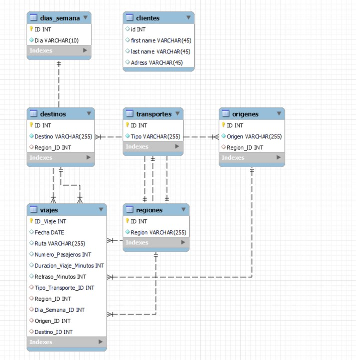
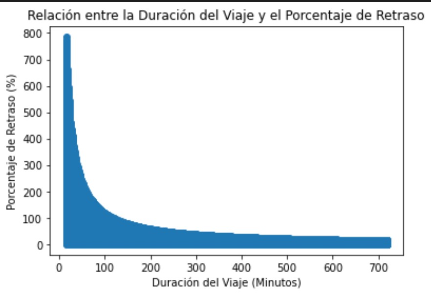
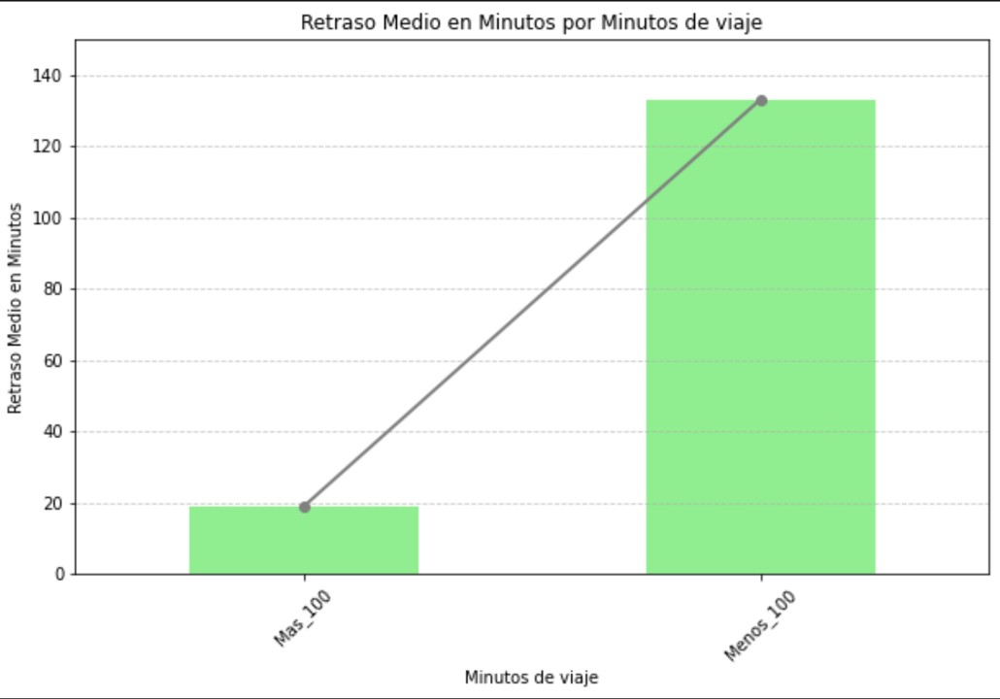
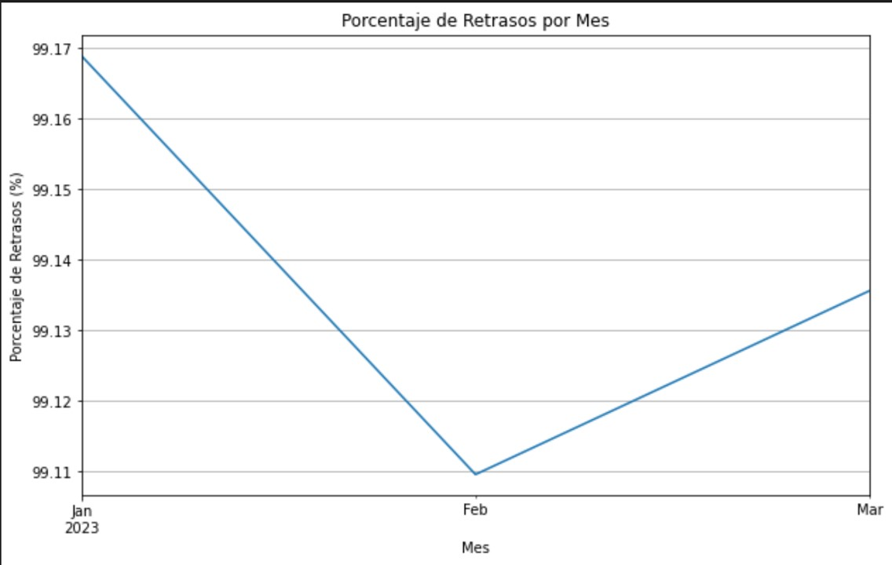
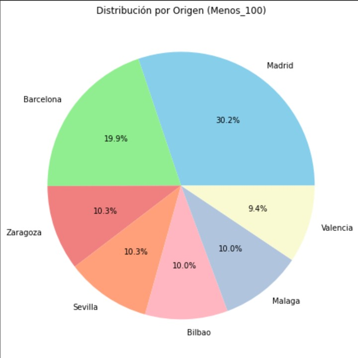

# Prueba Técnica Adalab: Análisis de Datos de Transporte Público en España

## Autor
**Ana Sánchez de la Fuente**

## Descripción del Proyecto
Este proyecto tiene como objetivo realizar un análisis exhaustivo del conjunto de datos sobre el transporte público en España. El propósito es identificar áreas de mejora en la eficiencia del transporte y reducir los retrasos.

## Requisitos
Este proyecto requiere las siguientes bibliotecas y herramientas:

- Python 3.x
- Pandas
- NumPy
- Matplotlib
- Seaborn
- Jupyter Notebook
- SQL (para la ejecución del script SQL)
- Power BI (para visualizar el dashboard)

## Contenidos del Repositorio
- **Transporte_ok.csv**: Archivo CSV limpio con los datos preparados para el análisis.
- **EDA.ipynb**: Jupyter Notebook que contiene el Análisis Exploratorio de Datos.
- **Analisis_Datos.ipynb**: Jupyter Notebook con el análisis detallado de los datos.
- **Insercion_Datos.ipynb**: Jupyter Notebook para la inserción de los datos en la base de datos desde Python.
- **Script_bddo.sql**: Script SQL para la creación de la base de datos y las tablas.
- **Dashboard.pbix**: Archivo del dashboard creado en Power BI.
- **README.md**: Este archivo, que proporciona una visión general del proyecto.

## Estructura de los Archivos

### Transporte_ok.csv
Contiene los datos limpios y preparados para el análisis.

### EDA.ipynb
1. **Exploración de los Datos**
   - Descripción del dataset y objetivos del análisis.
   - Carga y visualización inicial de los datos.
2. **Cambios de Tipo de Dato**
   - Conversión de tipos de datos para adecuarlos al análisis.
3. **Gestión de Nulos**
   - Identificación y tratamiento de valores faltantes.
4. **Gestión de Duplicados**
   - Detección y eliminación de registros duplicados.
5. **Creación de Columnas**
   - Generación de nuevas variables relevantes para el análisis.
6. **Mapeo**
   - Transformación de valores categóricos a numéricos.
7. **Exportación del DataFrame a CSV Limpio**
   - Guardado de los datos procesados en un archivo CSV para su uso posterior.

### Analisis_Datos.ipynb
1. **Análisis de la Información**
   - Evaluación detallada de las variables y sus relaciones.
2. **Visualizaciones**
   - Gráficos y representaciones visuales de los datos.
3. **A/B Testing**
   - Pruebas estadísticas para comparar grupos y evaluar diferencias significativas.
4. **Hallazgos**
   - Descubrimientos clave basados en el análisis de los datos.
5. **Resumen y Conclusiones**
   - Síntesis de los resultados obtenidos y recomendaciones.

### Insercion_Datos.ipynb
1. **Diseño de la Base de Datos en SQL**
   - Esquema de la base de datos.
2. **Inserción de Datos**
   - Código SQL para la creación de tablas.
   - Inserción de los datos en las tablas usando Python.

### Script_bddo.sql
Script SQL que define el esquema de la base de datos y crea las tablas necesarias.

### Dashboard.pbix
Archivo del dashboard de Power BI que incluye las principales conclusiones extraídas del análisis.

## Principales Conclusiones

- **Retrasos y Duración del Viaje**: Los viajes de **más de 100 minutos** tienden a tener **menos retrasos** y una mayor estabilidad en el porcentaje de retrasos, mientras que los **viajes más cortos** presentan una mayor variabilidad y retrasos más frecuentes.

- **Distribución de Retrasos**: Los datos muestran que los **viajes cortos (menos de 100 minutos)** tienen una mayor tendencia a retrasos, con una concentración alta de retrasos en estos trayectos. A partir de los 100 minutos, los retrasos se **estabilizan** y se mantienen en niveles bajos.

- **Análisis Estadístico**: La prueba de **Kolmogorov-Smirnov** indica que los datos no siguen una distribución normal, y la prueba de **Levene** revela diferencias significativas en las varianzas. Las pruebas de **T de Welch** y **Mann-Whitney** confirman diferencias significativas en los retrasos entre viajes cortos y largos.

- **Tendencias Temporales**: En **enero** se registran más retrasos, que **disminuyen en febrero** y siguen descendiendo en **marzo**. Este patrón sugiere que factores externos como condiciones meteorológicas, demanda de tickets o problemas técnicos pueden haber influido.

- **Ciudades de Origen y Destino**: **Madrid** es una ciudad de origen significativa para trayectos con más retrasos. Los destinos con mayor frecuencia de retrasos incluyen **Madrid, Barcelona y Sevilla**.

- **Próximos Pasos**: Se recomienda investigar los **factores externos** que afectan los retrasos para entender mejor las causas y patrones. Además, estudiar los factores en el grupo con **menos retrasos** podría ayudar a identificar prácticas que mejoren la eficiencia del transporte.

## Contacto

Para preguntas o comentarios, puedes contactarme a través de [mi correo electrónico](mailto:asandelafuente@gmail.com).

